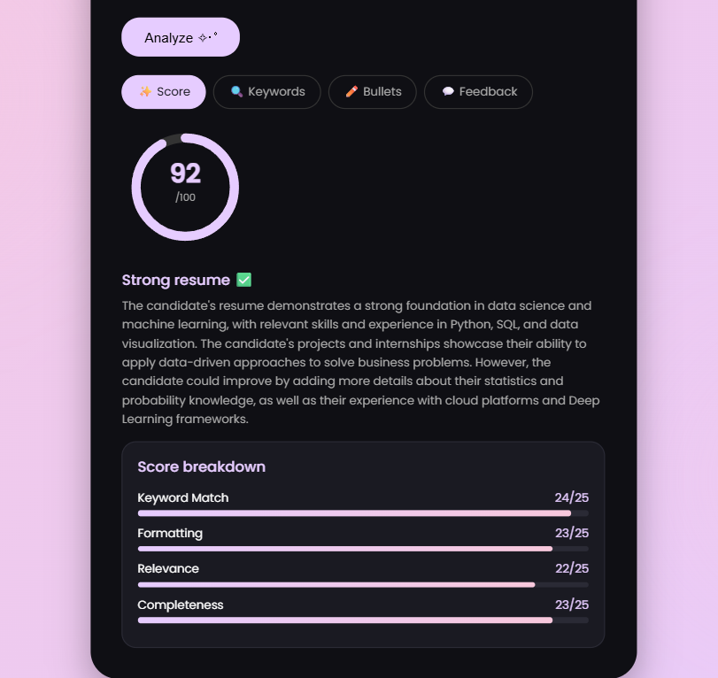
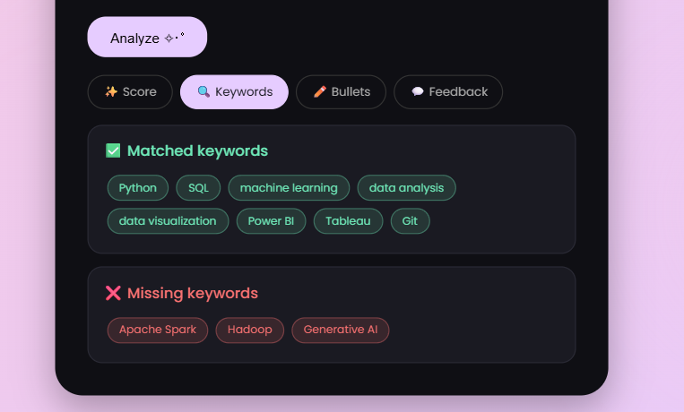
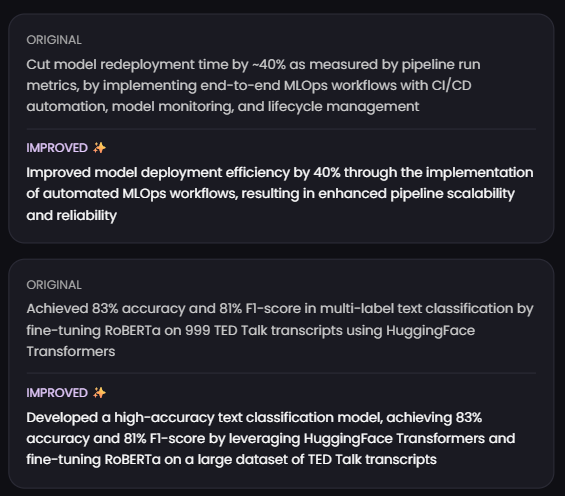
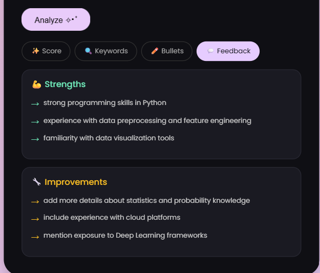

☆✧ Resume Analyzer ☆✧

An AI-powered full-stack web app that analyzes your resume against a job description and returns an ATS score, keyword gap analysis, improved bullet points, and actionable feedback — in under 10 seconds.

**Live Demo:** [resume-analyzer-two-pied.vercel.app](https://resume-analyzer-two-pied.vercel.app)

---

## Screenshots

### Score Tab


### Keywords Tab


### Bullets Tab


### Feedback Tab


---

## How It Works

1. User uploads a PDF resume — **PDF.js** extracts the text directly in the browser, no server round-trip needed
2. User optionally pastes a job description
3. React frontend sends both texts to the **Node.js backend** on Render
4. Backend builds a structured prompt instructing **LLaMA 3.3 70B via Groq API** to act as an ATS system and return a specific JSON schema
5. Backend strips any markdown the model adds, parses the JSON, and returns it to the frontend
6. React app renders results across four tabs: Score, Keywords, Bullets, Feedback

---

## Architecture

```
React Frontend (Vercel)
        │
        │  POST /analyze
        ▼
Node.js Backend Proxy (Render)
        │
        │  Groq API call
        ▼
LLaMA 3.3 70B (via Groq LPU)
```

The backend proxy is a deliberate security decision — the Groq API key lives only in Render's environment variables and never touches the browser. Anyone who opened DevTools on a client-side implementation could copy the key and drain the quota.

---

## Features

| Tab | What it shows |
|---|---|
| ✨ Score | ATS score out of 100, score breakdown across 4 dimensions (keyword match, formatting, relevance, completeness) |
| 🔍 Keywords | Matched keywords from the job description, missing keywords to add |
| ✏️ Bullets | Original resume bullets side-by-side with LLM-rewritten versions using stronger action verbs and metrics |
| 💬 Feedback | Strengths and specific improvement suggestions |

---

## ATS Scoring Logic

The LLM scores across four dimensions, each worth 25 points:

- **Keyword Match** — semantic matching between resume and job description (not just literal keywords — understands "built ML pipelines" = "machine learning workflows")
- **Formatting** — structure, clarity, use of action verbs
- **Relevance** — how well the experience matches the role
- **Completeness** — whether key sections and details are present

LLM-based scoring was chosen deliberately over rule-based keyword matching because semantic equivalence matters — a keyword matcher would miss matches that a human recruiter would catch.

---

## Tech Stack

**Frontend**
- React (Create React App)
- PDF.js — client-side PDF text extraction
- Deployed on Vercel

**Backend**
- Node.js + Express
- Groq API — LLaMA 3.3 70B on custom LPU hardware (~2s response time)
- Deployed on Render

---

## Why Groq + LLaMA 3.3 70B?

- Groq runs LLaMA on custom LPU hardware — significantly faster than OpenAI's API, typically under 2 seconds
- Generous free tier suitable for a personal project
- 70B parameter size gives strong instruction-following, which matters for reliably returning a specific JSON schema every time
- `temperature: 0` forces deterministic, consistent output

---

## Running Locally

### Backend
```bash
cd backend
npm install
# Create a .env file with your Groq API key:
# GROQ_API_KEY=gsk_your_key_here
node server.js
```

### Frontend
```bash
npm install
# Update the fetch URL in src/App.js to http://localhost:5000/analyze
npm start
```

---

## Known Limitations & Planned Improvements

- **Input length validation** — very long PDFs could exceed the model's context window; planning to truncate to ~3000 words before sending
- **Rate limiting** — no backend rate limiting currently; would add `express-rate-limit` to prevent quota drain
- **Result persistence** — every analysis is stateless; planning to add result storage so users can compare scores before and after edits

---

## Author

Built by **Kritika Yadav** 
 [GitHub](https://github.com/kritika62)
